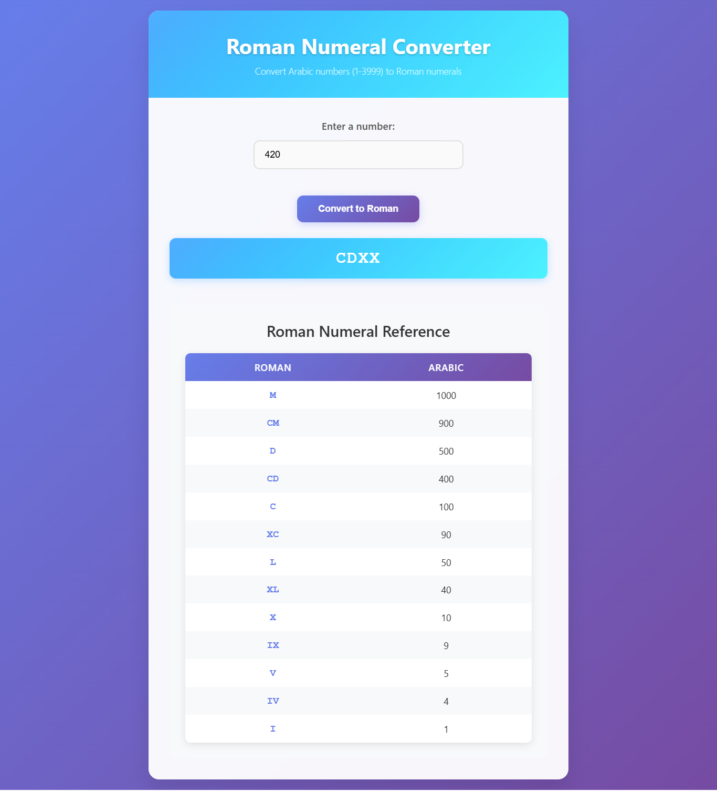

# 🏛️ Roman Numeral Converter App


A sophisticated Roman numeral converter that transforms Arabic numbers (1-3999) into their Roman numeral equivalents. Features an elegant interface with a comprehensive reference table and intelligent conversion algorithms.

## 📸 Screenshots

<div align="center">
  
  <p><em>Classical Roman numeral converter with reference table and elegant design</em></p>
</div>

## ✨ Live Demo

🌐 **[View Live Demo](https://your-live-demo-link.com)** *(Update after deployment)*

## 🚀 Key Features

- **🔢 Number Conversion**: Convert Arabic numbers (1-3999) to Roman numerals
- **📊 Reference Table**: Complete Roman numeral reference with values
- **⚡ Instant Results**: Real-time conversion with input validation
- **📱 Responsive Design**: Perfect experience on all devices
- **🎨 Classical UI**: Roman-inspired design with elegant typography
- **✅ Input Validation**: Ensures valid number range (1-3999)
- **🏛️ Educational**: Learn Roman numeral system with interactive examples
- **⌨️ Keyboard Support**: Enter key support for quick conversion

## 🎨 Design Features

### Visual Elements
- **Classical Typography**: Roman-inspired fonts and styling
- **Reference Table**: Complete conversion chart for learning
- **Clean Layout**: Minimalist design focusing on functionality
- **Visual Hierarchy**: Clear distinction between input, output, and reference

### User Experience
- **Instant Feedback**: Real-time validation and conversion
- **Error Prevention**: Input constraints and helpful messages
- **Educational Value**: Reference table for learning Roman numerals
- **Accessibility**: Screen reader friendly with proper labels

## 📱 Core Functionality

1. **🔢 Number Input** - Enter any Arabic number from 1 to 3999
2. **🏛️ Convert Button** - Transform number to Roman numeral
3. **📊 Result Display** - Show converted Roman numeral with formatting
4. **📋 Reference Table** - Complete Roman numeral chart for reference
5. **✅ Validation** - Ensure input is within valid range
6. **⚠️ Error Handling** - Clear messages for invalid inputs

## 🛠️ Tech Stack

- **⚡ Frontend**: HTML5, CSS3, Vanilla JavaScript
- **🎨 Styling**: CSS Grid, Flexbox, Classical design elements
- **📱 Responsive**: Mobile-first responsive design
- **🧮 Algorithm**: Efficient Roman numeral conversion logic
- **♿ Accessibility**: WCAG compliant with semantic HTML

## 🚀 Getting Started

### Prerequisites

- Modern web browser with JavaScript enabled
- No additional dependencies required

### Installation

1. **Clone the repository**
   ```bash
   git clone https://github.com/your-username/roman-numeral-converter-app.git
   cd roman-numeral-converter-app-shibam
   ```

2. **Open the application**
   ```bash
   # Option 1: Open directly in browser
   open index.html
   
   # Option 2: Use a local server (recommended)
   python -m http.server 8000
   # or
   npx serve .
   ```

3. **Start converting numbers**
   - Enter a number between 1 and 3999
   - Click "Convert to Roman" or press Enter
   - View the Roman numeral result

## 📁 Project Structure

```
roman-numeral-converter-app-shibam/
├── 📄 index.html              # Main HTML structure
├── 🎨 styles.css              # Styling and responsive design
├── ⚡ script.js               # Conversion logic and validation
├── 📸 screenshot/             # Application screenshots
├── 📖 README.md               # Project documentation
├── 📜 LICENSE                 # MIT License
└── 🚫 .gitignore              # Git ignore rules
```

## 🛠️ Technologies Used

<table>
<tr>
<td align="center"><br><b>HTML5</b></td>
<td align="center"><br><b>CSS3</b></td>
<td align="center"><br><b>JavaScript</b></td>
<td align="center"><br><b>Git</b></td>
</tr>
</table>

## 🎯 Algorithm Features

### Roman Numeral Conversion Logic
1. **Value Mapping**: Uses predefined value-to-numeral mappings
2. **Greedy Algorithm**: Converts using largest values first
3. **Subtractive Notation**: Handles cases like IV (4), IX (9), CD (400), CM (900)
4. **Efficient Processing**: O(1) time complexity for conversion

### Supported Roman Numerals
- **M** = 1000
- **CM** = 900 (subtractive: 1000-100)
- **D** = 500
- **CD** = 400 (subtractive: 500-100)
- **C** = 100
- **XC** = 90 (subtractive: 100-10)
- **L** = 50
- **XL** = 40 (subtractive: 50-10)
- **X** = 10
- **IX** = 9 (subtractive: 10-1)
- **V** = 5
- **IV** = 4 (subtractive: 5-1)
- **I** = 1

## 🧮 Usage Examples

### Example 1: Simple Number
- **Input**: 27
- **Output**: XXVII
- **Breakdown**: XX (20) + V (5) + II (2) = 27

### Example 2: Subtractive Notation
- **Input**: 1994
- **Output**: MCMXCIV
- **Breakdown**: M (1000) + CM (900) + XC (90) + IV (4) = 1994

### Example 3: Large Number
- **Input**: 3999
- **Output**: MMMCMXCIX
- **Breakdown**: MMM (3000) + CM (900) + XC (90) + IX (9) = 3999

### Example 4: Edge Cases
- **Input**: 1 → **Output**: I
- **Input**: 5 → **Output**: V
- **Input**: 10 → **Output**: X

## 🌐 Deployment

### 🚀 Quick Deploy Options

1. **GitHub Pages**
   - Push to GitHub repository
   - Enable GitHub Pages in repository settings
   - Access via `https://username.github.io/repository-name`

2. **Netlify**
   - Drag and drop project folder to Netlify
   - Get instant live URL with HTTPS

3. **Vercel**
   - Import GitHub repository
   - Zero-configuration deployment

## 📊 Performance Features

- **Lightweight**: Minimal code footprint for fast loading
- **Efficient Algorithm**: O(1) time complexity for conversion
- **No Dependencies**: Pure vanilla JavaScript for maximum compatibility
- **Optimized DOM**: Minimal DOM manipulation for smooth performance

## 🔧 Available Scripts

```bash
# Development
python -m http.server 8000    # Start local development server
npx serve .                   # Alternative local server

# Testing
# Test with various numbers including edge cases
# Verify conversion accuracy with reference table
```

## 🧪 Testing Examples

Try these conversions:
- **Small Numbers**: 1, 5, 10, 50, 100
- **Subtractive Cases**: 4 (IV), 9 (IX), 40 (XL), 90 (XC), 400 (CD), 900 (CM)
- **Complex Numbers**: 1994 (MCMXCIV), 2023 (MMXXIII), 3999 (MMMCMXCIX)
- **Edge Cases**: 1 (minimum), 3999 (maximum)
- **Invalid Inputs**: 0, 4000, negative numbers, non-numeric input

## 🏛️ Roman Numeral History

### Educational Context
- **Ancient System**: Used in ancient Rome for trade and record-keeping
- **Additive System**: Based on addition of symbol values
- **Subtractive Rules**: Special cases to avoid repetition (e.g., IV instead of IIII)
- **Modern Usage**: Still used in clocks, book chapters, movie sequels, and formal documents

### Conversion Rules
1. **Basic Addition**: Symbols are added together (VI = 5 + 1 = 6)
2. **Subtractive Notation**: Smaller numeral before larger means subtraction (IV = 5 - 1 = 4)
3. **Repetition Limits**: No symbol repeated more than three times consecutively
4. **Valid Subtractions**: Only I, X, and C can be subtracted, and only from the next two higher values

## ♿ Accessibility Features

- **Semantic HTML**: Proper form structure and labeling
- **Keyboard Navigation**: Full keyboard support with Enter key
- **Screen Reader Support**: ARIA labels and descriptive text
- **High Contrast**: Clear visual distinction between elements
- **Focus Management**: Visible focus indicators

## 📝 License

This project is open source and available under the [MIT License](LICENSE).

## 🤝 Contributing

Contributions, issues, and feature requests are welcome! Feel free to check the [issues page](https://github.com/your-username/roman-numeral-converter-app/issues).

## 📞 Contact

**Shibam Banerjee**
- Email: Connect-With-Shibam@outlook.com
- Phone: +91 62902-18960
- LinkedIn: [linkedin.com/in/shibam-webdev](https://linkedin.com/in/shibam-webdev)
- GitHub: [github.com/Shibam-Code-Pro](https://github.com/Shibam-Code-Pro)

## 🙏 Acknowledgments

- [freeCodeCamp](https://www.freecodecamp.org/) for algorithm challenges and inspiration
- [MDN Web Docs](https://developer.mozilla.org/) for comprehensive JavaScript documentation
- Ancient Roman mathematicians for creating this fascinating numeral system

---

⭐ **If you found this project helpful, please give it a star!** ⭐
